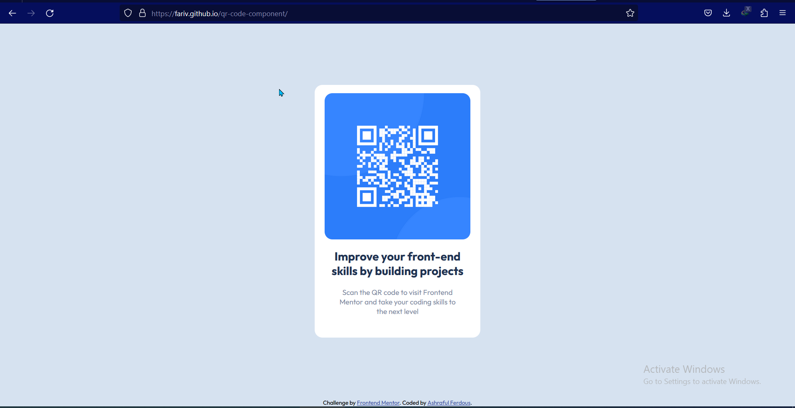

# Frontend Mentor - QR code component solution

This is a solution to the [QR code component challenge on Frontend Mentor](https://www.frontendmentor.io/challenges/qr-code-component-iux_sIO_H). Frontend Mentor challenges help you improve your coding skills by building realistic projects. 

## Table of contents

- [Overview](#overview)
  - [Screenshot](#screenshot)
  - [Links](#links)
- [My process](#my-process)
  - [Built with](#built-with)
  - [What I learned](#what-i-learned)
  - [Useful resources](#useful-resources)
- [Author](#author)

## Overview

### Screenshot

### Links

- Live Site URL: [Add live site URL here](https://fariv.github.io/qr-code-component)

## My process
- First set up html structure
- Then style the structure with CSS

### Built with

- HTML5 markup
- Flexbox

### What I learned

I learned flexbox vertical and horizontal centering.

### Useful resources

- [Vertical alignment css](https://blog.logrocket.com/15-ways-implement-vertical-alignment-css/) - This helped me learn more about vertical centering

## Author

- Frontend Mentor - [@Fariv](https://www.frontendmentor.io/profile/Fariv)
- Linkedin - [@AshrafulFerdous](https://www.linkedin.com/in/ashraful-ferdous-190652119/)
